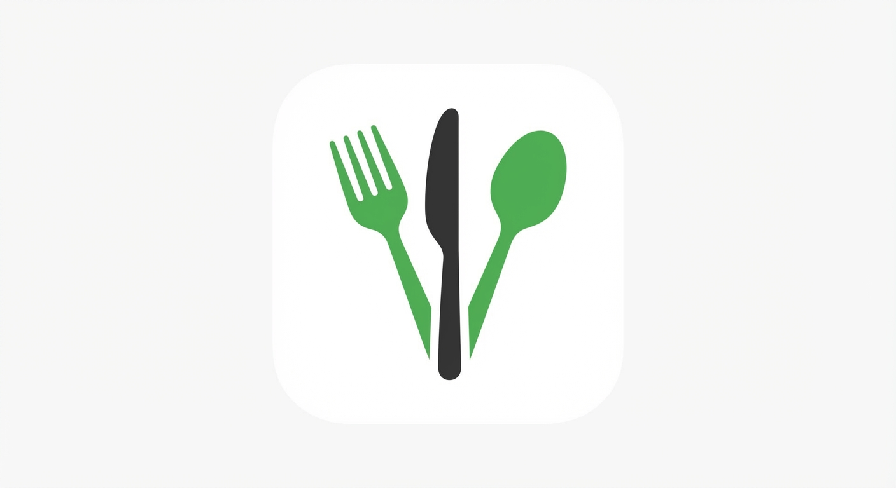

  

  # Food Context Protocol

  **An open standard enabling interoperability between AI agents, applications, and food data providers to facilitate seamless food intelligence integrations.**

  [Documentation](index.md) ·
  [Specification](specification.md) ·
  [Discussions](https://github.com/Food-Context-Protocol/fcp/discussions)

---

## Overview

The Food Context Protocol (FCP) addresses fragmentation in food AI systems by enabling communication between platforms (like AI agents and apps), food data providers (USDA, OpenFoodFacts), nutrition databases, and recipe services.

## Why FCP?

### Standardization
Currently, each food application rebuilds nutrition analysis, recipe search, and safety checks from scratch. FCP provides a common language for food intelligence.

### Modularity
FCP defines composable capabilities (nutrition, recipes, safety, inventory) that applications can adopt incrementally rather than requiring all-or-nothing integration.

### Agentic Commerce Support
Built for AI agents acting on behalf of users to analyze meals, plan nutrition, and manage food safely—powered by modern LLMs like Gemini 3.

### Protocol-First
Dual transport (MCP stdio + REST HTTP) ensures FCP works with CLI tools, web apps, mobile apps, and AI platforms like Claude Desktop.

## Key Features

- **🔧 Composable Architecture** - 40+ typed tools organized by capability domain
- **🔍 Dynamic Discovery** - MCP tool listing enables runtime capability discovery
- **🚀 Transport Flexibility** - Supports both MCP stdio and REST HTTP
- **🎯 Standards Integration** - Built on OpenAPI, JSON Schema, and MCP specification
- **👨‍💻 Developer Accessible** - Auto-generated SDKs with comprehensive documentation

## Core Capabilities

### Nutrition Analysis
Analyze food photos for nutrition data, detect allergens, extract meal composition.

### Recipe Management
Search recipes, scale ingredients, extract from videos, suggest substitutions.

### Food Safety
Real-time FDA recall alerts grounded in Google Search with cited sources.

### Inventory Tracking
Manage pantry items, track expiration dates, generate shopping lists.

## Getting Started

### 📖 Read the Specification
Start with [specification.md](specification.md) to understand the protocol.

### 🧪 Try the Reference Implementation
See [Food-Context-Protocol/fcp-gemini-server](https://github.com/Food-Context-Protocol/fcp-gemini-server) for a Python implementation.

### 📦 Use the SDKs
- [Python SDK](https://github.com/Food-Context-Protocol/python-sdk)
- [TypeScript SDK](https://github.com/Food-Context-Protocol/typescript-sdk)

### 🔧 Implement Your Own
Follow the [specification](specification.md) to build FCP in any language.

## Repository Structure

- **`specification/`** - Protocol specification documents
- **`docs/`** - Documentation and assets

## Contributing

We welcome contributions! See [contributing.md](contributing.md) for:
- How to propose specification changes
- Discussion process
- Pull request guidelines

## Governance

FCP uses a meritocratic governance model. See [governance.md](governance.md) for details on:
- Technical Council
- Decision-making process
- Contribution pathways

## Implementations

### Official
- [Python (Reference)](https://github.com/Food-Context-Protocol/fcp-gemini-server) - FastAPI + MCP stdio

### Community
_Coming soon - implement FCP in your language!_

## Roadmap

- ✅ **v1.0**: Core capabilities (nutrition, recipes, safety, inventory)
- ✅ **v1.1**: Gemini integration (multimodal, grounding, thinking)
- 🚧 **v1.2**: Multi-provider support (USDA, OpenFoodFacts, Spoonacular)
- 📋 **v2.0**: Conformance testing suite
- 📋 **v2.1**: Additional transports (WebSocket, gRPC)

## License

Apache-2.0 - See [LICENSE](../LICENSE)

---

  <strong>Like Stripe for payments, FCP for food AI</strong>

